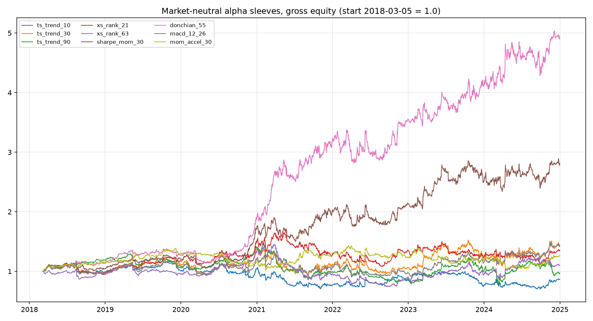
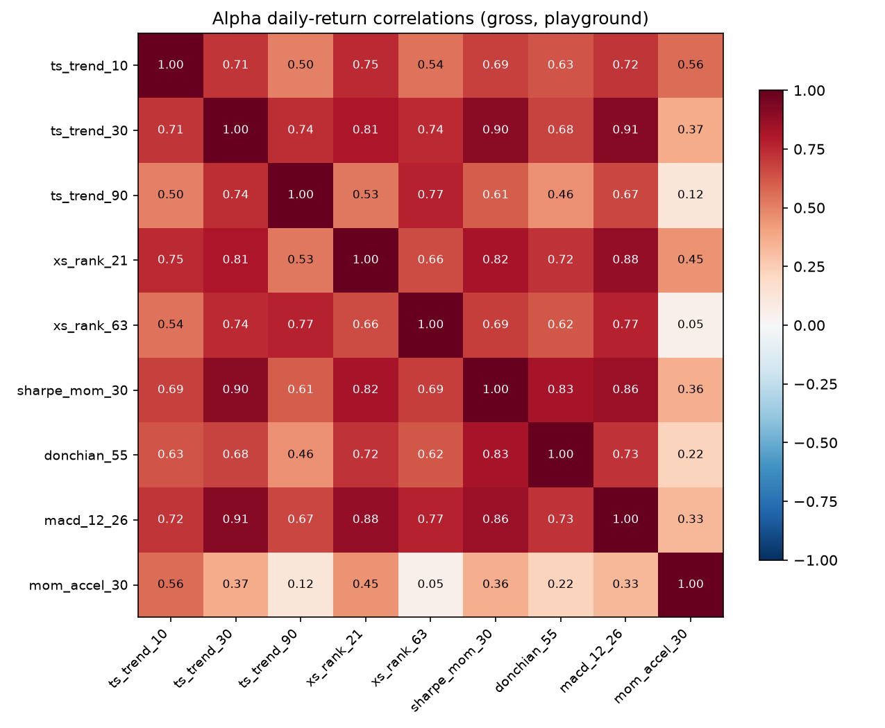
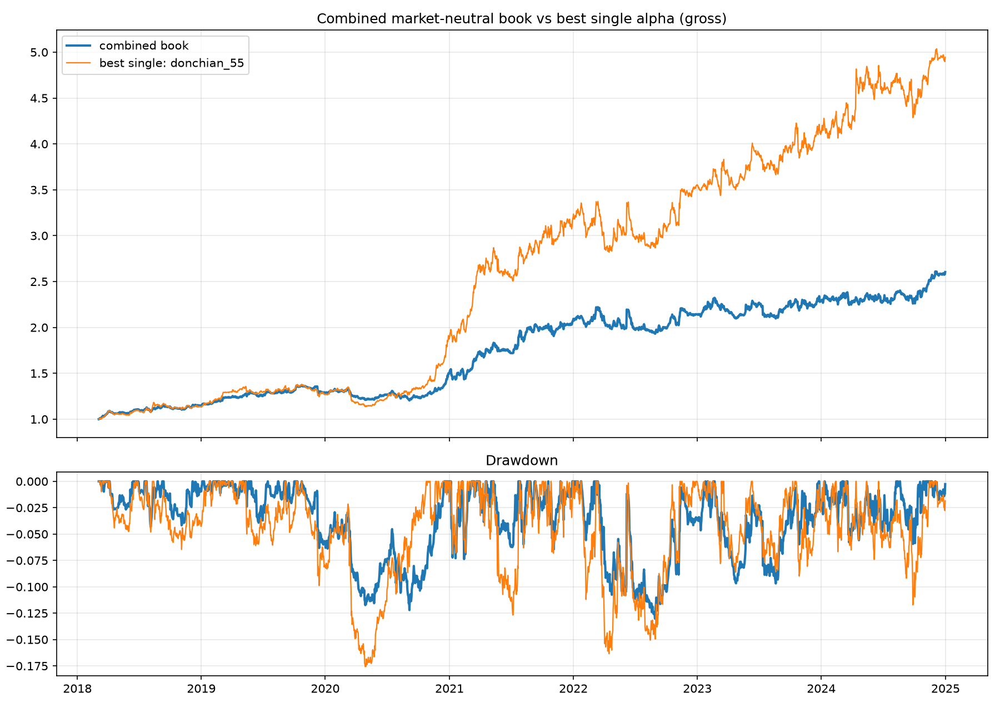
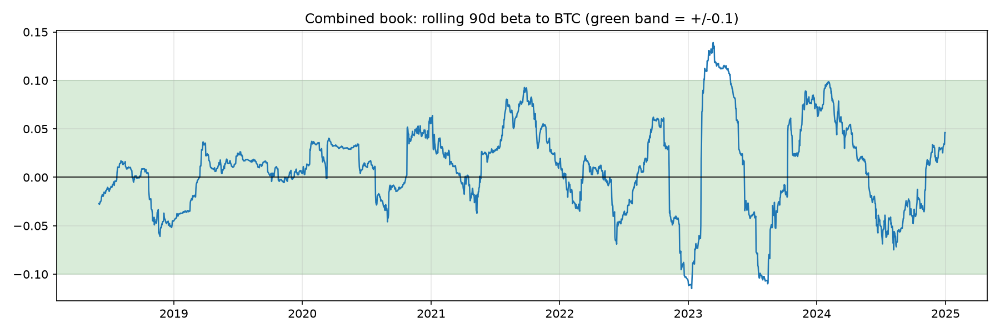

# Alpha Research Report: a stable of market-neutral crypto momentum alphas

Firm-sim deliverable (docs/08_FIRM_SIM_CHARTER.md, Handoff #8). Panel: broad Binance discovery dataset (survivorship-conscious, corporate-action seams severed; see research/stage_a_data_report.md). Window: 2018-03-05..2024-12-31 (playground); the OOS vault (2025-01-01+) is excluded from everything until the single final evaluation in section 6. All results GROSS of costs and funding (dormant hooks in the engine); a realism layer is future work and noted in the limitations.

## 1. The stable

Nine signals, one construction. Each raw signal is cross-sectionally z-scored (winsorized at 3), sized inverse-vol, hedged to ex-ante zero beta against BTC with a hedge leg (rolling 90d betas), and scaled to a 15% annualized vol target under gross (2.0) and per-name (10%) caps, weekly Monday rebalance. So the differences below are differences in INFORMATION, not construction.

| alpha | family | idea |
|---|---|---|
| ts_trend_10 | ts_trend | 10d own trailing return (fast trend) |
| ts_trend_30 | ts_trend | 30d own trailing return (medium trend) |
| ts_trend_90 | ts_trend | 90d own trailing return (slow trend) |
| xs_rank_21 | xs_rank | 21d return, cross-sectional percentile rank |
| xs_rank_63 | xs_rank | 63d return, cross-sectional percentile rank |
| sharpe_mom_30 | sharpe_mom | 30d return / 30d realized vol |
| donchian_55 | breakout | position in trailing 55d close channel |
| macd_12_26 | ma_distance | (EMA12 - EMA26) / price |
| mom_accel_30 | acceleration | 14d change in 30d momentum |

*(A funding/term-structure momentum sleeve is future work: it requires perp funding-rate history we do not ingest yet.)*

## 2. Standalone performance (gross, playground)

| alpha | Sharpe | ann vol | maxDD | turnover/yr | avg gross | beta to BTC | hit |
|---|---:|---:|---:|---:|---:|---:|---:|
| ts_trend_10 | -0.00 | 20.3% | -39.8% | 2907% | 0.91 | +0.010 | 48.3% |
| ts_trend_30 | +0.35 | 22.7% | -34.7% | 1730% | 1.02 | +0.017 | 50.1% |
| ts_trend_90 | +0.07 | 19.3% | -46.9% | 1052% | 0.90 | -0.002 | 49.9% |
| xs_rank_21 | +0.33 | 18.6% | -34.4% | 2406% | 1.07 | +0.013 | 49.9% |
| xs_rank_63 | +0.17 | 19.4% | -48.9% | 1597% | 1.13 | -0.001 | 51.7% |
| sharpe_mom_30 | +0.86 | 19.9% | -21.1% | 1933% | 1.01 | +0.022 | 51.5% |
| donchian_55 | +1.38 | 18.2% | -17.6% | 2000% | 0.99 | +0.023 | 50.6% |
| macd_12_26 | +0.35 | 20.9% | -29.7% | 1739% | 0.99 | +0.014 | 50.6% |
| mom_accel_30 | +0.30 | 15.5% | -27.9% | 2112% | 0.75 | +0.001 | 53.0% |

**Cost and funding sensitivity note (per the WS-C brief).** These are gross numbers and
the turnover column is the threat: annual cost drag is approximately 2 x turnover x
cost-per-side, so a 2,000%/yr sleeve loses ~4 points of return per year at even 10 bps
per side, ~10 points at 25 bps, plus perp funding on ~1.0x average gross (roughly the
funding rate itself, historically ~5-10%/yr on crypto perps, partially earned back on
short legs). At 15% target vol, sleeves below ~+0.5 gross Sharpe have no realistic
chance of surviving a cost layer; donchian_55 and sharpe_mom_30 are the only sleeves
with meaningful headroom, and slowing the rebalance (or widening bands) is the first
lever before any of this is quoted net.

### Regime slices (gross Sharpe by regime)

| alpha | bull | bear | 2019 chop | 2020 covid crash | 2020-21 bull | 2022 bear | 2023-24 recovery |
|---|---:|---:|---:|---:|---:|---:|---:|
| ts_trend_10 | -0.16 | +0.22 | +0.39 | -2.14 | -0.58 | +0.56 | +0.15 |
| ts_trend_30 | +0.46 | +0.19 | +0.56 | -2.83 | +0.43 | +0.09 | +0.72 |
| ts_trend_90 | -0.10 | +0.39 | -0.90 | +1.21 | -0.14 | -0.43 | +0.33 |
| xs_rank_21 | +0.45 | +0.19 | +1.62 | -1.34 | +0.54 | +0.27 | +0.10 |
| xs_rank_63 | +0.13 | +0.23 | -0.04 | +1.77 | -0.07 | +0.12 | +0.55 |
| sharpe_mom_30 | +1.15 | +0.49 | +1.18 | -3.58 | +1.76 | +0.52 | +0.75 |
| donchian_55 | +1.92 | +0.75 | +1.19 | -3.77 | +2.92 | +0.84 | +1.00 |
| macd_12_26 | +0.61 | +0.00 | +0.36 | -2.48 | +0.35 | -0.07 | +0.93 |
| mom_accel_30 | -0.04 | +0.80 | +0.96 | -0.93 | +0.08 | -0.12 | +0.19 |

## 3. Market-neutrality check

Realized full-window beta to BTC per sleeve is in the table above: largest magnitude 0.023. The combined book's rolling beta is in section 5. Construction is hedged ex ante; realized betas stay near zero ex post.

## 4. Correlation structure and selection

Pre-registered rule (in alpha_research.py before results): rank by Sharpe, accept iff Sharpe >= 0.3 and max |corr| to already-accepted < 0.5.

- donchian_55: SELECTED (Sharpe +1.38, max |corr| to selected 0.00)
- sharpe_mom_30: REJECTED (|corr| 0.83 with donchian_55 >= 0.5)
- macd_12_26: REJECTED (|corr| 0.73 with donchian_55 >= 0.5)
- ts_trend_30: REJECTED (|corr| 0.68 with donchian_55 >= 0.5)
- xs_rank_21: REJECTED (|corr| 0.72 with donchian_55 >= 0.5)
- mom_accel_30: SELECTED (Sharpe +0.30, max |corr| to selected 0.22)
- xs_rank_63: REJECTED (Sharpe +0.17 < 0.3)
- ts_trend_90: REJECTED (Sharpe +0.07 < 0.3)
- ts_trend_10: REJECTED (Sharpe -0.00 < 0.3)

**Selected subset (2): donchian_55, mom_accel_30.**

## 5. The combined book (the diversification result)

Equal-capital blend of the 2 selected sleeves (each sleeve is vol-targeted at 15%, so equal capital is approximately equal risk). Weights are netted BEFORE trading, so the combination also nets turnover.

| series | Sharpe | ann vol | maxDD | Calmar | turnover/yr | beta to BTC |
|---|---:|---:|---:|---:|---:|---:|
| **combined** | **+1.13** | 13.2% | -13.0% | +1.15 | 1667% | +0.012 |
| donchian_55 (standalone) | +1.38 | | | | 2000% | |
| mom_accel_30 (standalone) | +0.30 | | | | 2112% | |

**The pre-registered combination did NOT beat the best sleeve on Sharpe: +1.13 combined versus +1.38 for donchian_55.** The arithmetic explains it: blending two sleeves at rho = 0.22 beats the better one only if the weaker sleeve's Sharpe exceeds roughly 0.56 times the stronger (about +0.78 here); mom_accel_30 at +0.30 is far below that, so its diversification could not pay for its return drag. What the blend DID deliver: lower volatility (13.2% versus ~18% per sleeve), the shallowest drawdown of anything in the stable (-13.0% versus -17.6% for the best sleeve), turnover netting (1,667% versus 2,056% sleeve mean), and positive Sharpe in BOTH trend regimes (bull +1.30, bear +0.93; regime table below). That last property is the market-neutral payoff: every long-only result in this project so far was bull-conditional.

The correct reading of the fundamental law: breadth only pays when the independent bets are of comparable quality. Nine momentum variants collapsed to roughly two independent bets, one strong and one marginal. The next research increment is not another momentum variant (they run 0.7 to 0.9 correlated with each other); it is alphas from genuinely different families (funding/carry, liquidity, seasonality) that can stand next to the channel signal at comparable Sharpe.

### Regime breakdown: combined book (gross)

**By trend regime (BTC vs 200d SMA):**

| regime | days | total ret | CAGR | vol | Sharpe | maxDD |
|---|---:|---:|---:|---:|---:|---:|
| bull | 1327 | +81.4% | +9.1% | 13.3% | +1.30 | -11.5% |
| bear | 1167 | +43.5% | +5.6% | 13.1% | +0.93 | -16.2% |

**By named eras:**

| regime | days | total ret | CAGR | vol | Sharpe | maxDD |
|---|---:|---:|---:|---:|---:|---:|
| 2017-18 mania and bust | 302 | +14.6% | +18.0% | 7.7% | +2.18 | -4.3% |
| 2019 chop | 410 | +14.4% | +12.7% | 8.9% | +1.39 | -6.4% |
| 2020 covid crash | 61 | -6.8% | -34.9% | 9.8% | -4.25 | -8.1% |
| 2020-21 bull | 574 | +61.2% | +35.5% | 15.6% | +2.03 | -8.0% |
| 2022 bear | 416 | +8.8% | +7.7% | 16.1% | +0.54 | -13.0% |
| 2023-24 recovery | 731 | +21.6% | +10.3% | 13.4% | +0.80 | -9.7% |

## 6. Validation

**Walk-forward folds** (anchored, 13-week tests, fixed pre-registered construction, no per-fold selection): positive in 17/23 folds.

| fold | window | return | Sharpe |
|---|---|---:|---:|
| 1 | 2019-03-04 to 2019-05-27 | +6.3% | +2.81 |
| 2 | 2019-06-03 to 2019-08-26 | +0.7% | +0.42 |
| 3 | 2019-09-02 to 2019-11-25 | +4.4% | +2.14 |
| 4 | 2019-12-02 to 2020-02-24 | -3.2% | -1.05 |
| 5 | 2020-03-02 to 2020-05-25 | -6.1% | -2.74 |
| 6 | 2020-06-01 to 2020-08-24 | +0.1% | +0.10 |
| 7 | 2020-08-31 to 2020-11-23 | +8.5% | +2.86 |
| 8 | 2020-11-30 to 2021-02-22 | +14.1% | +2.83 |
| 9 | 2021-03-01 to 2021-05-24 | +14.5% | +3.27 |
| 10 | 2021-05-31 to 2021-08-23 | +14.2% | +2.86 |
| 11 | 2021-08-30 to 2021-11-22 | +2.6% | +0.70 |
| 12 | 2021-11-29 to 2022-02-21 | +2.2% | +0.82 |
| 13 | 2022-02-28 to 2022-05-23 | -3.1% | -0.65 |
| 14 | 2022-05-30 to 2022-08-22 | -3.7% | -0.57 |
| 15 | 2022-08-29 to 2022-11-21 | +11.4% | +3.12 |
| 16 | 2022-11-28 to 2023-02-20 | +5.6% | +1.91 |
| 17 | 2023-02-27 to 2023-05-22 | -3.5% | -1.23 |
| 18 | 2023-05-29 to 2023-08-21 | -4.3% | -1.24 |
| 19 | 2023-08-28 to 2023-11-20 | +6.7% | +1.86 |
| 20 | 2023-11-27 to 2024-02-19 | +3.0% | +1.03 |
| 21 | 2024-02-26 to 2024-05-20 | +0.7% | +0.27 |
| 22 | 2024-05-27 to 2024-08-19 | +1.4% | +0.48 |
| 23 | 2024-08-26 to 2024-11-18 | +8.0% | +2.18 |

**Deflated Sharpe:** DSR = 0.655 with K = 79, the TOTAL trials-ledger count across the whole project (every backtest ever executed, per docs/04). Verdict: indistinguishable from selection noise (n = 2494 daily obs, skew 1.05, kurtosis 20.9).

**The vault (single look, now spent).** The combined book, rebuilt on the full panel with identical construction and equal weights (nothing fitted), scored once on 2025-01-01 onward:

- Sharpe +0.49, total return +5.9%, maxDD -12.0%, beta to BTC -0.010 over 548 days (~78 weekly observations, Sharpe SE ~0.8: a disaster check, not a certification).

## 7. Limitations (read before quoting any number above)

- **Gross only.** No trading costs, no perp funding, no borrow constraints. At these turnover levels a realistic cost layer will take a large bite; that layer is the next workstream and nothing here is claimed net.
- **One market cycle.** The playground spans 2018-2024: one full bear, one mania, one recovery. Regime tables above show which sleeves depend on which regimes.
- **Multiple testing.** K in the DSR is the full ledger count, but trials are correlated variants, so the deflation is approximate in both directions.
- **Shorting is abstracted.** Perp availability, margin, and funding asymmetries are assumed away at the research layer by charter; capacity and borrow reality can only shrink these numbers.
- **Single-factor neutrality.** Books are hedged to BTC only; residual sector or size exposures may remain (a sector factor model is noted as future work).
