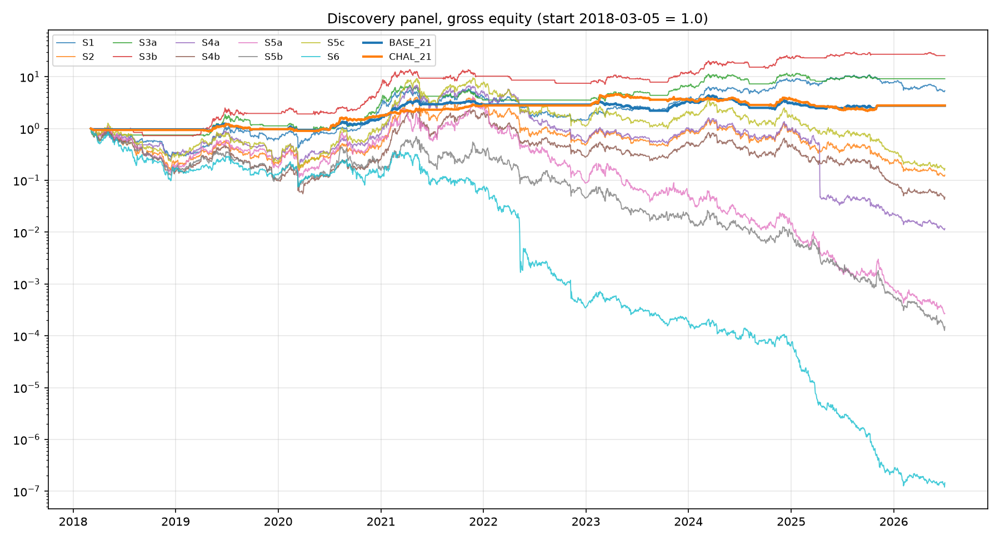

# Discovery baselines: the ladder and Phase 2 re-run GROSS on the broad universe

Window: **2018-03-05..2026-07-02** (435 weekly observations). Universe: discovery panel (Binance single-source, >= $5M/day point-in-time screen, dead coins included, halt-split). All numbers GROSS: this compares signal shapes across universes, not tradability. Old-panel numbers are the Kraken execution panel from PHASE1_RESULTS.md / PHASE2_RESULTS.md (gross columns).

| run | new gross Sharpe | old gross Sharpe | new maxDD | old maxDD | new turnover | old turnover |
|---|---:|---:|---:|---:|---:|---:|
| S1 | +0.64 | +0.73 | -76.6% | -76.6% | 0% | 0% |
| S2 | +0.16 | +0.53 | -97.0% | -83.6% | 476% | 461% |
| S3a | +0.83 | +0.82 | -51.0% | -51.0% | 162% | 180% |
| S3b | +1.12 | +1.08 | -48.0% | -48.0% | 216% | 209% |
| S4a | -0.02 | +0.61 | -99.8% | -85.7% | 1560% | 1429% |
| S4b | +0.03 | +0.31 | -98.2% | -93.8% | 2312% | 2109% |
| S5a | -0.23 | +0.37 | -100.0% | -94.7% | 2481% | 2183% |
| S5b | -0.35 | +0.54 | -100.0% | -92.2% | 2617% | 2375% |
| S5c | +0.25 | +0.48 | -98.4% | -91.6% | 2061% | 2105% |
| S6 | -0.98 | +0.15 | -100.0% | -98.1% | 4437% | 4097% |
| BASE_21 | +0.64 | +1.05 | -46.6% | -37.2% | 553% | 508% |
| CHAL_21 | +0.64 | +1.16 | -53.3% | -35.1% | 435% | 502% |

### Regime breakdown: BASE_21 (gross, discovery panel)

**By trend regime (BTC vs 200d SMA):**

| regime | days | total ret | CAGR | vol | Sharpe | maxDD |
|---|---:|---:|---:|---:|---:|---:|
| bull | 1594 | +364.1% | +22.2% | 31.2% | +1.28 | -41.2% |
| bear | 1448 | -40.6% | -6.1% | 8.9% | -1.43 | -43.0% |

**By named eras:**

| regime | days | total ret | CAGR | vol | Sharpe | maxDD |
|---|---:|---:|---:|---:|---:|---:|
| 2017-18 mania and bust | 302 | -3.4% | -4.1% | 2.8% | -1.50 | -3.8% |
| 2019 chop | 410 | +14.3% | +12.7% | 20.5% | +0.68 | -25.2% |
| 2020 covid crash | 61 | -15.1% | -63.0% | 25.6% | -3.69 | -11.6% |
| 2020-21 bull | 574 | +255.9% | +124.5% | 29.9% | +2.85 | -18.9% |
| 2022 bear | 416 | -13.0% | -11.5% | 8.9% | -1.32 | -16.1% |
| 2023-24 recovery | 731 | +6.0% | +2.9% | 29.6% | +0.25 | -46.6% |
| 2025+ vault era | 548 | -10.5% | -7.1% | 21.7% | -0.23 | -24.9% |

### Regime breakdown: CHAL_21 (gross, discovery panel)

**By trend regime (BTC vs 200d SMA):**

| regime | days | total ret | CAGR | vol | Sharpe | maxDD |
|---|---:|---:|---:|---:|---:|---:|
| bull | 1594 | +274.8% | +18.8% | 32.0% | +1.10 | -45.0% |
| bear | 1448 | -25.6% | -3.5% | 7.6% | -0.95 | -28.6% |

**By named eras:**

| regime | days | total ret | CAGR | vol | Sharpe | maxDD |
|---|---:|---:|---:|---:|---:|---:|
| 2017-18 mania and bust | 302 | -6.0% | -7.3% | 4.3% | -1.73 | -7.2% |
| 2019 chop | 410 | +8.6% | +7.6% | 20.4% | +0.46 | -23.4% |
| 2020 covid crash | 61 | -11.5% | -52.4% | 25.2% | -2.77 | -9.3% |
| 2020-21 bull | 574 | +193.8% | +98.7% | 29.3% | +2.49 | -11.9% |
| 2022 bear | 416 | +5.2% | +4.5% | 6.4% | +0.72 | -7.3% |
| 2023-24 recovery | 731 | +32.0% | +14.9% | 31.2% | +0.60 | -41.8% |
| 2025+ vault era | 548 | -24.3% | -17.0% | 22.4% | -0.72 | -41.7% |

### Regime breakdown: S5a (gross, discovery panel)

**By trend regime (BTC vs 200d SMA):**

| regime | days | total ret | CAGR | vol | Sharpe | maxDD |
|---|---:|---:|---:|---:|---:|---:|
| bull | 1594 | +6.4% | +0.8% | 122.3% | +0.61 | -99.1% |
| bear | 1448 | -100.0% | -63.0% | 116.1% | -1.20 | -100.0% |

**By named eras:**

| regime | days | total ret | CAGR | vol | Sharpe | maxDD |
|---|---:|---:|---:|---:|---:|---:|
| 2017-18 mania and bust | 302 | -81.8% | -87.3% | 88.2% | -1.88 | -87.2% |
| 2019 chop | 410 | +107.1% | +91.5% | 90.7% | +1.17 | -71.4% |
| 2020 covid crash | 61 | -61.0% | -99.7% | 173.6% | -2.17 | -67.6% |
| 2020-21 bull | 574 | +1269.8% | +429.7% | 150.6% | +1.84 | -76.5% |
| 2022 bear | 416 | -95.6% | -93.6% | 116.8% | -1.75 | -97.9% |
| 2023-24 recovery | 731 | -84.5% | -60.7% | 116.1% | -0.23 | -94.8% |
| 2025+ vault era | 548 | -98.0% | -92.7% | 114.3% | -1.72 | -98.3% |

## Observations

**1. The wide cross-section did NOT rescue cross-sectional momentum. It buried it.**
The Handoff #7 hypothesis was that the thin Kraken universe had been strangling XS
signals and a broad cross-section would help them. The opposite happened: raw XS top-3
went from gross Sharpe +0.37 (thin panel) to -0.23 (broad panel) with a near-total
drawdown, and reversal collapsed to -0.98. Mechanism: with 64 to 260 liquid names, the
top-3 by trailing return is a rotating bag of the most-pumped microcaps, and pump
reversal eats the long leg (see the S5a regime table above: +1,270% in the 2020-21
mania, then -96%, -85%, -98% across the three eras since). The telling contrast is S5c
(top-quintile, 13 to 52 holdings): +0.25 versus top-3's -0.23 on identical signals. On
a broad universe, diversification WITHIN the cross-section matters more than breadth
itself. Any future XS work on this panel should abandon top-3 concentration.

**2. What survived the harder test.** The BTC trend filters are untouched (S3b +1.12;
they never touch the cross-section), and the Phase 2 overlay stack (gate + inverse-vol
+ cap + vol target) kept both candidates at +0.64 gross with maxDD around -47 to -53%
on a window that includes 2018, versus -98 to -100% for every naive construction.
On the harder panel the base-vs-challenger head-to-head is a dead heat (0.64 vs 0.64);
the Stage D conclusion (ties go to the simpler base case) is unchanged.

**3. The regime breakdown says the edge is bull-conditional.** BASE_21 gross: Sharpe
+1.28 across bull-regime days, -1.43 across bear-regime days (small but persistent
losses: the gate is evaluated only at Monday closes, so each mid-week trend break
leaks a few crossing days of losses before the book exits). By era, essentially all
profit lives in the 2020-21 bull (+256%); 2019 chop is mildly positive; the covid
crash is a fast -15%; the 2022 bear is a contained -13% (versus -77% for BTC held
through it); 2023-24 is barely positive; and the 2025+ era is NEGATIVE for both
candidates (base -10.5%, challenger -24.3%). This matches the literature (crypto
momentum is bull-market conditional) and is the single most important caveat on the
Phase 2 candidate: it earns in bulls, survives bears, and has made nothing net-new
since 2023 on this panel.

**4. Caveats.** These are gross numbers on Binance-tradable breadth: a discovery lens,
not a tradability claim (the Kraken gate comes later for survivors). Equal-weighting
holders is the naive spec construction and is exactly what the overlays fix. The
2025+ era shown here spans the OOS vault: acceptable for FIXED reference baselines,
but tunable sandbox ideas never see it (run_alpha withholds it structurally).
