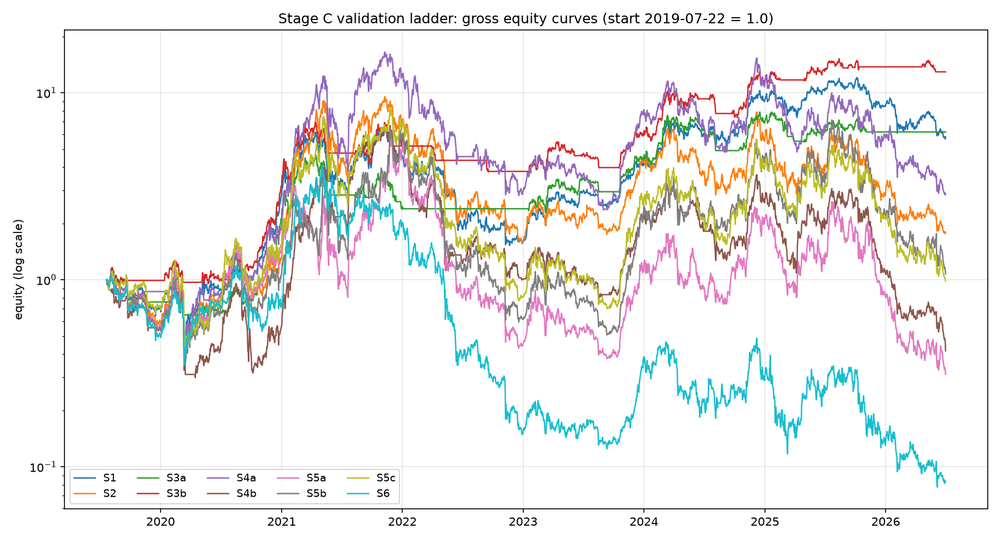
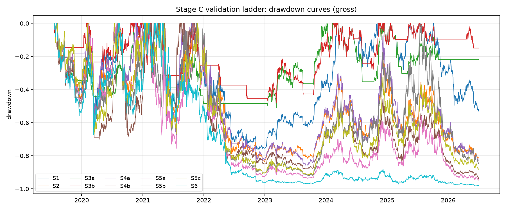

# Phase 1 results: the classic-strategy validation ladder (Stage C)

Window: **2019-07-22 to 2026-07-01** (363 weekly rebalance observations). Universe: point-in-time liquidity-screened Kraken USD pairs (see research/stage_a_data_report.md). Annualization 365. Weekly Monday rebalance. Tie-breaks alphabetical.

## Pre-registration (from docs/03, written before any run)

The grid is the ten required runs of docs/03 section 8, run gross (the spec's setting) plus net at 25 and 50 bps per side (DEC-002). Predicted orderings, registered in the spec before execution:

- Max drawdown shallowest to deepest: S3a/S3b and S4a shallowest; S1 middle; S2, S5x, S6 deepest.
- Turnover lowest to highest: S1 < S3x < S2 < S4x < S5x and S6.
- Time-in-market: S1 = S2 = S5x = S6 = 100%; S3x and S4x below 100%.
- S6 is the weakest or among the weakest; if S6 dramatically beats S5, suspect the harness.

## Comparison table (gross of costs)

| run | params | total ret | CAGR | vol | Sharpe | Sortino | maxDD | Calmar | turnover/yr | hit | TIM |
|---|---|---:|---:|---:|---:|---:|---:|---:|---:|---:|---:|
| S1 | `{"asset": "BTC"}` | +479.9% | +28.8% | 60.9% | +0.73 | +1.19 | -76.6% | +0.38 | 0% | 50.2% | 100% |
| S2 | `{}` | +79.0% | +8.7% | 82.8% | +0.53 | +0.83 | -83.6% | +0.10 | 461% | 52.6% | 100% |
| S3a | `{"asset": "BTC", "N": 200}` | +517.2% | +29.9% | 43.5% | +0.82 | +1.33 | -51.0% | +0.59 | 180% | 51.4% | 58% |
| S3b | `{"asset": "BTC", "N": 100}` | +1193.6% | +44.5% | 42.2% | +1.08 | +1.81 | -48.0% | +0.93 | 209% | 52.0% | 56% |
| S4a | `{"L": 90, "k": 0}` | +188.2% | +16.5% | 85.8% | +0.61 | +1.00 | -85.7% | +0.19 | 1429% | 51.1% | 93% |
| S4b | `{"L": 30, "k": 0}` | -58.3% | -11.8% | 88.0% | +0.31 | +0.49 | -93.8% | -0.13 | 2109% | 51.4% | 91% |
| S5a | `{"L": 30, "k": 0, "select": "top3"}` | -68.8% | -15.4% | 104.8% | +0.37 | +0.63 | -94.7% | -0.16 | 2183% | 49.4% | 100% |
| S5b | `{"L": 30, "k": 7, "select": "top3"}` | +7.2% | +1.0% | 105.9% | +0.54 | +0.94 | -92.2% | +0.01 | 2375% | 49.5% | 100% |
| S5c | `{"L": 30, "k": 0, "select": "q20"}` | -1.5% | -0.2% | 94.1% | +0.48 | +0.80 | -91.6% | -0.00 | 2105% | 50.4% | 100% |
| S6 | `{"L": 7, "select": "bottom3"}` | -91.6% | -30.0% | 99.9% | +0.15 | +0.25 | -98.1% | -0.31 | 4097% | 50.5% | 100% |

## Net of costs (DEC-002: 50 bps/side decides, 25 bps/side optimistic)

| run | gross Sharpe | net Sharpe @25bps | net Sharpe @50bps | gross CAGR | net CAGR @25bps | net CAGR @50bps |
|---|---:|---:|---:|---:|---:|---:|
| S1 | +0.73 | +0.73 | +0.73 | +28.8% | +28.8% | +28.8% |
| S2 | +0.53 | +0.50 | +0.47 | +8.7% | +6.3% | +3.8% |
| S3a | +0.82 | +0.80 | +0.78 | +29.9% | +28.8% | +27.6% |
| S3b | +1.08 | +1.06 | +1.03 | +44.5% | +43.0% | +41.6% |
| S4a | +0.61 | +0.53 | +0.45 | +16.5% | +8.4% | +0.9% |
| S4b | +0.31 | +0.19 | +0.07 | -11.8% | -20.7% | -28.6% |
| S5a | +0.37 | +0.26 | +0.16 | -15.4% | -24.2% | -32.1% |
| S5b | +0.54 | +0.43 | +0.32 | +1.0% | -10.3% | -20.4% |
| S5c | +0.48 | +0.36 | +0.25 | -0.2% | -10.2% | -19.2% |
| S6 | +0.15 | -0.05 | -0.26 | -30.0% | -43.0% | -53.6% |

## Gate checks

- PASS: s1_reproduces_btc
- PASS: turnover_ordering
- PASS: full_exposure_strategies
- PASS: filtered_strategies_below_full
- PASS: s3_s4_shallower_than_s1
- PASS: s6_not_best

## Observations

**Predictions versus outcomes.** All registered orderings held except one, and the exception is
instructive:

1. **Turnover ordering held exactly** (S1 0% < S3x 180-209% < S2 462% < S4x 1,429-2,109% <
   S5x 2,105-2,375% and S6 4,097%). The absolute levels are far above the spec's guesses for
   S2/S4 because the auto-enumerated universe (132 ever-liquid names) churns at the $1M bar:
   marginal coins enter and exit weekly, and every membership flip trades the book. The old
   hand-picked 22-coin universe hid this; the honest wide universe does not.
2. **Time-in-market held** (S1 = S2 = S5x = S6 at 100%; S3a 58%, S3b 56%, S4x low 90s).
3. **Drawdown ordering held for the trend filters but NOT for TSMOM.** S3a/S3b cut BTC's
   -76.6% drawdown to -51%/-48%: the Faber filter did its one job. But S4a (-85.7%) and
   S4b (-93.8%) came out DEEPER than equal-weight (-83.6%), against the prediction.
   Investigated before crediting, per the spec's own rule. Two mechanical causes, both real.
   First, equal-weighting the holders concentrates the book: in 15% of weeks the entire
   portfolio sat in 1 or 2 coins (the spec itself flagged this consequence of skipping
   MOP-style vol scaling). Second, the 2022 bear was a stair-step: each relief rally flipped
   some alts' trailing 90-day return positive, so the "bear brake" repeatedly re-entered
   dying alts (average largest single position through the 2021-11 to 2023-09 drawdown
   window: 27% of the book). The engine mechanics are pinned by unit tests; this is the
   strategy's true shape on a window containing a real bear, and it is exactly the failure
   mode the Phase 2 base case is designed to address (inverse-vol sizing, 25% name cap,
   portfolio-level BTC gate).
4. **S6 reversal is the weakest, as predicted** (gross Sharpe 0.15, maxDD -98.1%, turnover
   4,097%): buying 7-day losers in a bear market is a knife-catching machine. It did not
   dramatically outperform S5, so the negative-control check passes.

**The cost wall is the headline.** Gross-to-net50 Sharpe: S5a 0.37 to 0.16, S4b 0.31 to 0.07,
S6 0.15 to -0.26, while the low-turnover runs barely move (S1 unchanged at 0.73, S3b 1.08 to
1.03). At 50 bps per side, 2,000%+ one-sided turnover costs roughly 20% of the book per year,
which is the size of the entire documented crypto momentum premium. This reproduces the
literature's core finding (Han, Kang and Ryu 2024) before we have tested a single original
idea, and it is the project thesis in one table.

**Mild surprises, stated without over-reading.** S5b (skip-7) beat S5a (no skip) gross 0.54 vs
0.37, against the research doc's prior that long skips hurt among liquid majors; and S4a (90d)
beat S4b (30d), against the short-lookback prior. Both gaps are inside two Sharpe standard
errors on this window and are noted, not concluded from.

**Benchmark reality check.** Only the S3 trend filters beat buy-and-hold BTC on risk-adjusted
numbers both gross and net. Every cross-sectional variant LOST money in absolute terms over
7 years gross (S5a total return -68.8%), while simply holding BTC made +480%. A strategy that
cannot beat S1 or S3 net of costs has no reason to exist; that is the bar Phase 2 must clear.

## Thin-universe warning (restated verbatim from docs/03 section 5)

> Our screened universe is thin. Top-3 means each pick is a third of the book, so this is a concentrated bet on 3 coins, not a diversified factor portfolio. Consequences: (i) single-name events hit the equity curve hard; (ii) performance statistics will be noisy and regime-dependent, so do not over-read Sharpe differences between XS variants on this window; (iii) the classic academic decile construction is impossible here, which is why we use top-N and top-quintile instead; (iv) any later improvement to XS momentum must first be checked against the possibility that it is just noise from 3-name concentration.

## Statistical power statement (docs/04 section 3.2)

This window contains 363 weekly observations, so the annualized Sharpe standard error is roughly 0.38 and a 95% confidence interval on any Sharpe here is about plus or minus 0.7. Nothing in these tables is statistical proof of an edge; the grid itself is 10 runs, and the expected best Sharpe of 10 pure-noise trials on this sample is material (docs/04 section 1.1). These runs validate the ENGINE and build intuition. They do not certify any strategy.

