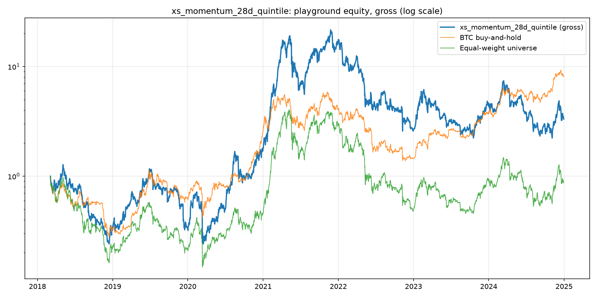

# Alpha sandbox report: `xs_momentum_28d_quintile`

Playground window: 2017-08-17 to 2024-12-31 (vault 2025-01-01+ excluded from all tuning). Panel: discovery (broad, gross-judged). Params: `{'lookback': 28, 'quantile': 0.2}`. Ledger trials for this family: K = 13.

## Verdict (plain English)

- Gross Sharpe +0.68 vs BTC +0.80 and equal-weight +0.43: does NOT beat both benchmarks on the playground.
- Noise floor: the Sharpe standard error here is ~0.38, and this idea's family has K=13 ledger trials, so treat anything under ~0.8 as indistinguishable from selection noise.
- Parameter plateau: stable (>=75% of the grid shares the headline sign).
- Fold consistency: positive in 11/23 walk-forward folds.
- Tradability preview (NOT a discovery criterion): net-50bps Sharpe +0.46 at 2173%/yr turnover.

## Headline metrics (GROSS decides at discovery; net is a preview)

| series | Sharpe | CAGR | vol | maxDD | Calmar | turnover/yr | TIM |
|---|---:|---:|---:|---:|---:|---:|---:|
| xs_momentum_28d_quintile (gross) | +0.68 | +19.2% | 97.4% | -89.7% | +0.21 | 2173% | 100% |
| xs_momentum_28d_quintile (net 50bps preview) | +0.46 | -4.1% | 97.4% | -94.6% | -0.04 | 2173% | 100% |
| benchmark: BTC buy-and-hold | +0.80 | +36.0% | 66.2% | -76.6% | +0.47 | 0% | 100% |
| benchmark: Equal-weight universe | +0.43 | -2.0% | 88.2% | -88.7% | -0.02 | 473% | 100% |

### Regime breakdown: xs_momentum_28d_quintile (gross)

**By trend regime (BTC vs 200d SMA):**

| regime | days | total ret | CAGR | vol | Sharpe | maxDD |
|---|---:|---:|---:|---:|---:|---:|
| bull | 1327 | +13917.4% | +106.2% | 93.1% | +1.93 | -62.6% |
| bear | 1167 | -97.6% | -43.3% | 101.7% | -0.62 | -98.6% |

**By named eras:**

| regime | days | total ret | CAGR | vol | Sharpe | maxDD |
|---|---:|---:|---:|---:|---:|---:|
| 2017-18 mania and bust | 302 | -67.9% | -74.8% | 88.2% | -1.11 | -81.1% |
| 2019 chop | 410 | +123.7% | +105.1% | 93.3% | +1.24 | -72.6% |
| 2020 covid crash | 61 | -57.7% | -99.5% | 163.4% | -2.15 | -63.1% |
| 2020-21 bull | 574 | +5528.3% | +1203.1% | 113.3% | +2.85 | -70.8% |
| 2022 bear | 416 | -84.8% | -80.9% | 96.2% | -1.23 | -88.1% |
| 2023-24 recovery | 731 | +27.7% | +13.0% | 80.8% | +0.55 | -70.0% |

## Parameter plateau sweep (gross Sharpe per combination)

| lookback | quantile | Sharpe | maxDD | turnover |
|---|---|---|---|---|
| 14.0 | 0.1 | +0.64 | -92.6% | 3289% |
| 14.0 | 0.2 | +0.58 | -92.1% | 2888% |
| 14.0 | 0.3 | +0.56 | -91.1% | 2623% |
| 21.0 | 0.1 | +0.62 | -95.8% | 2848% |
| 21.0 | 0.2 | +0.60 | -94.1% | 2488% |
| 21.0 | 0.3 | +0.59 | -91.5% | 2229% |
| 28.0 | 0.1 | +0.70 | -93.0% | 2394% |
| 28.0 | 0.2 | +0.68 | -89.7% | 2173% |
| 28.0 | 0.3 | +0.62 | -90.9% | 1930% |
| 56.0 | 0.1 | +0.34 | -98.0% | 1788% |
| 56.0 | 0.2 | +0.45 | -94.5% | 1603% |
| 56.0 | 0.3 | +0.48 | -92.6% | 1466% |

## Walk-forward folds (fixed params; consistency, not selection)

| fold | window | return | Sharpe |
|---|---|---:|---:|
| 1 | 2019-03-04 to 2019-05-27 | +97.8% | +3.41 |
| 2 | 2019-06-03 to 2019-08-26 | -20.0% | -0.49 |
| 3 | 2019-09-02 to 2019-11-25 | -20.7% | -0.89 |
| 4 | 2019-12-02 to 2020-02-24 | -9.5% | +0.22 |
| 5 | 2020-03-02 to 2020-05-25 | -6.9% | +0.63 |
| 6 | 2020-06-01 to 2020-08-24 | +226.7% | +5.30 |
| 7 | 2020-08-31 to 2020-11-23 | -10.6% | +0.06 |
| 8 | 2020-11-30 to 2021-02-22 | +293.5% | +5.11 |
| 9 | 2021-03-01 to 2021-05-24 | +72.3% | +2.20 |
| 10 | 2021-05-31 to 2021-08-23 | +42.2% | +1.86 |
| 11 | 2021-08-30 to 2021-11-22 | +57.8% | +2.50 |
| 12 | 2021-11-29 to 2022-02-21 | -55.3% | -3.12 |
| 13 | 2022-02-28 to 2022-05-23 | -50.8% | -2.36 |
| 14 | 2022-05-30 to 2022-08-22 | -11.2% | +0.02 |
| 15 | 2022-08-29 to 2022-11-21 | -21.5% | -0.37 |
| 16 | 2022-11-28 to 2023-02-20 | +70.5% | +2.73 |
| 17 | 2023-02-27 to 2023-05-22 | -31.4% | -1.50 |
| 18 | 2023-05-29 to 2023-08-21 | -33.7% | -2.46 |
| 19 | 2023-08-28 to 2023-11-20 | +39.7% | +2.20 |
| 20 | 2023-11-27 to 2024-02-19 | +45.1% | +2.49 |
| 21 | 2024-02-26 to 2024-05-20 | +1.3% | +0.53 |
| 22 | 2024-05-27 to 2024-08-19 | -40.8% | -2.53 |
| 23 | 2024-08-26 to 2024-11-18 | +21.3% | +1.38 |

*(Discovery judges gross performance and regime robustness on the broad panel. Kraken tradability, thin-universe constraints, and the DEC-002 cost lens are a later gate for survivors. See docs/ALPHA_SANDBOX.md.)*
